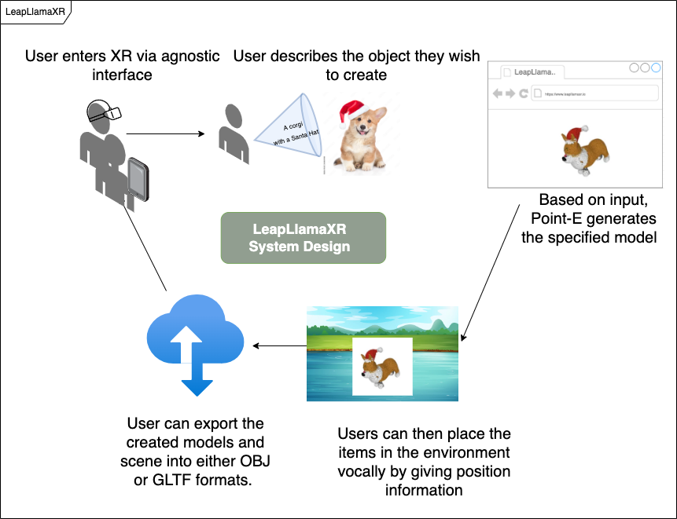

# LeapLlamaXR
This repository is an overview of a proposed project.

**L**earning and **E**ducation through **A**ugmented **P**lay / No code solutions using OSS LLM descriptors in WebXR 

Creating XR (Extended Reality) based world generation using large language models for no-code solutions. This involves leveraging the capabilities of language models like the open source Llama2/GPT-2 to enable users to generate immersive virtual worlds without the need for traditional coding. 

# System Diagram

# Equipment to be used on the project

## GPU Cluster:

- 4 x Quadro RTX 6000

## Mixed reality Lab

- Enterprise/Consumer level VR & AR headsets
- Sensor arrays
- Biometric capture equipment

## Digital Photogrammetry Lab

- Botspot Botscan NEO - 82 camera array scanner